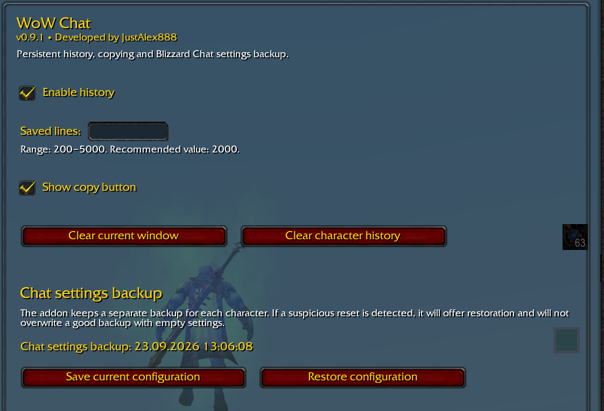
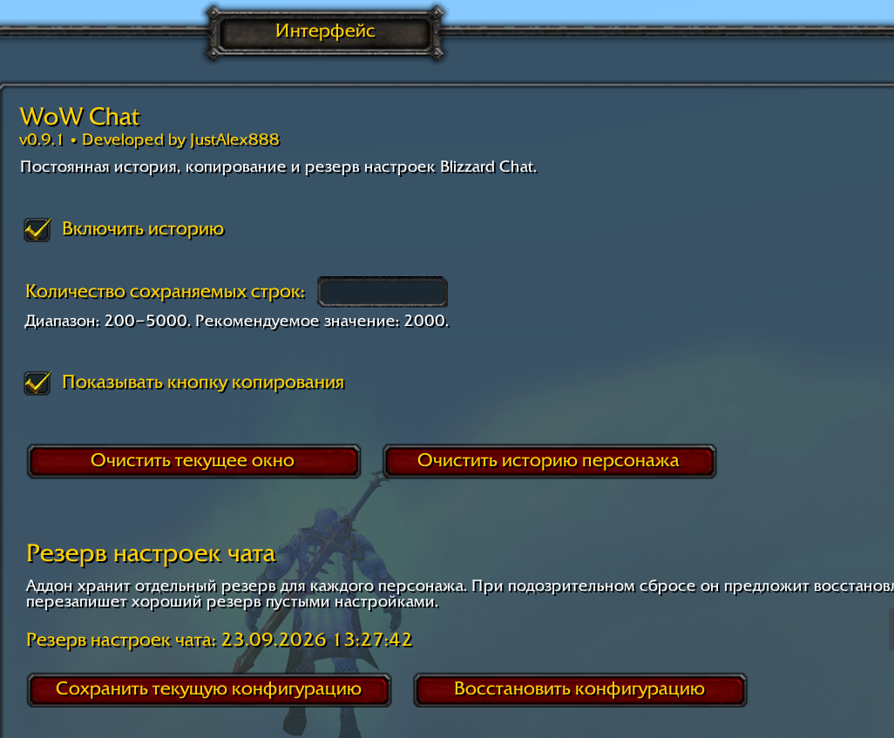
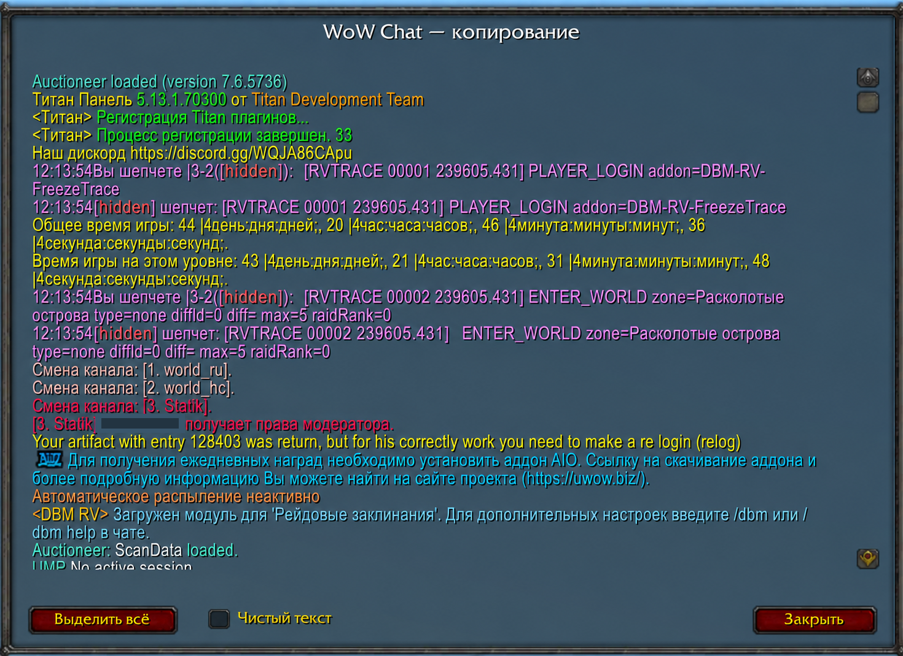

# WoW Chat

[English](README.md) | [Русский](README_RU.md)

Lightweight persistent chat history, copy, and Blizzard Chat settings backup for **World of Warcraft: Legion 7.3.5**.

> Current public testing version: **v0.9.1 (pre-release)**

## Features

- Persistent chat history between sessions
- Separate history storage for each character
- Copy window for saved chat history
- Preserves message colors in the copy window
- Optional **Clean Text** mode for plain-text copying
- Blizzard Chat configuration backup and restore
- Protection against overwriting a good backup with an obviously reset/empty configuration
- Russian and English interface localization
- Language override commands for testing
- Lightweight design focused on minimal overhead

## Screenshots

### Settings — English

### Settings — Russian

### Copy window

## Installation

1. Download the latest release ZIP.
2. Extract the `WoW_Chat` folder into:
   `World of Warcraft/Interface/AddOns/`
3. Restart the game client or run `/reload` if the addon was already present.
4. Open the settings with `/wowchat`.

## Commands

- `/wowchat` — open addon settings
- `/uwowchat` — legacy compatibility command
- `/wowchat lang ruRU` — force Russian interface
- `/wowchat lang enUS` — force English interface
- `/wowchat lang auto` — use the game client locale

After changing the forced language, run `/reload`.

## Compatibility

- Target client: **World of Warcraft Legion 7.3.5 (Interface 70300)**
- Tested on: **UWoW 7.3.5 client**

## Scope

WoW Chat is not intended to replace full chat-modification suites. It focuses on persistent history, convenient copying, and restoring chat configuration after accidental resets.

## Author and development

Created by **JustAlex888**.

Development assistance: **OpenAI ChatGPT**.

AI assistance was used for architecture discussion, implementation support, debugging, and documentation drafting. Requirements, testing, and final project decisions were made by the author.

## License

MIT License. See [LICENSE](LICENSE).
